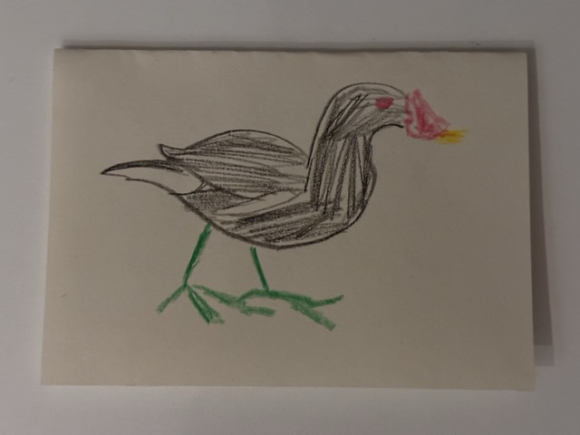
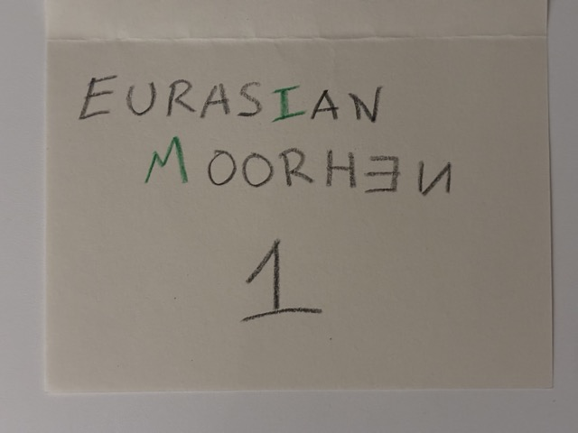

# Birds Surprise

This repository documents the steps I took to generate a list of birds I could use to encode a secret message, as part of a Christmas surprise in 2024.


## Backstory

For Christmas 2024 I purchased a book of Spanish birds as a gift. I was also required to create some kind of puzzle or prank for the recipient of the gift. I decided to draw several Spanish birds terribly in crayon and hide them around the recipient's home, and their task was to find them and then deduce a secret message from the birds' names.

The secret message was encoded by writing a subset of the bird names' letters backwards - or in a different colour if the letter was symmetrical - such that if all the backwards and coloured letters were read in sequence they would form a secret message.

For example, to encode the message "HELLOWORLD", one may use the following bird names:

- **HE**RRING GU**LL**
- YELL**OW**-BR**O**WED WA**R**B**L**ER
- **D**UNLIN

Why write the letters backwards? Because the gift was actually from my pet cat Iris, of course - this explains why the illustrations are so terrible, and as we all know when cats are tasked with writing English text they often erroneously transcribe letters backwards. Here she is, reviewing the terrible JavaScript and Python code I wrote:


The book didn't arrive in time to be given on Christmas, so the secret message ~~I~~ Iris encoded in these bird names was:

> I'm enjoying looking at all the bird pictures, but I will post it soon.


## Instructions

First, clone this repo:

```bash
git clone git@github.com/theteacat/birds-surprise
cd birds-surprise
```

Next, extract all of the bird names from [Wikipedia's Spanish Birds page](https://en.wikipedia.org/wiki/List_of_birds_of_Spain#Ducks,_geese,_and_waterfowl) by running the following javascript snippet in the developer tools of your browser:

```javascript
let tmpInput = document.createElement("textarea")
tmpInput.value = (
    Array.from(
        document.getElementsByClassName("div-col")
    ).map(
        divcol => divcol.children[0]
    ).map(
        ul => Array.from(
            ul.children
        ).map(
            li => li.children[0].innerText
        ).join("\n")
    ).join("\n")
)
tmpInput.select()
setTimeout(()=>{
    navigator.clipboard.writeText(tmpInput.value)
    console.log(`Copied to the clipboard: ${tmpInput.value}`)
}, 3000)
```

You then need to focus on the webpage within 3 seconds so the `navigator.clipboard.writeText` call doesn't fail.

This will put a list of all the birds' names in your clipboard, which can then be pasted into the [`birds.csv`](./birds.csv) file. As of 24/12/2024 there should be 420 of them.

**NOTE:** If you're providing your own different list of words, you need to ensure every letter that you want to use in your hidden message appears in at least one of your words; otherwise it will not be possible to encode your message.

Now you have a dataset of bird names, you can run my terrible Python code:

```bash
python3 main.py
```

My terrible Python code will ask you for a target message. If you don't have one in mind yet, there is a default.


## Example Output

```
Target Message (I'm enjoying looking at all the bird pictures, but I will post it soon.): 
Target Sequence: IMENJOYINGLOOKINGATALLTHEBIRDPICTURESBUTIWILLPOSTITSOON
IMEN---------------------------------------------------: EURASIAN MOORHEN
----JO-------------------------------------------------: STEJNEGER'S SCOTER
------YING---------------------------------------------: EGYPTIAN GOOSE
----------LOOK-----------------------------------------: LESSER SHORT-TOED LARK
--------------INGATA-----------------------------------: MOURNING WHEATEAR
--------------------LLTHE------------------------------: ATLAS FLYCATCHER
-------------------------BIRDPI------------------------: BAIRD'S SANDPIPER
-------------------------------CTURE-------------------: CINEREOUS VULTURE
------------------------------------SBUTI--------------: HOUSE BUNTING
-----------------------------------------WILLP---------: WILSON'S PHALAROPE
----------------------------------------------OSTITS---: RUFOUS-TAILED ROCK-THRUSH
----------------------------------------------------OON: SOOTY TERN
Total birds required: 12
Average letters per bird: 4.583333333333333
```


## Example Illustrations

| Illustration                                                 | Text                                                         | Hidden Text |
| ------------------------------------------------------------ | ------------------------------------------------------------ | ----------- |
|                 |                         |             |
|  |  | IMEN        |
|  |  | JO          |
|  |  | YING        |
|  |  | LOOK        |
|  |  | INGATA      |
|  |  | LLTHE       |
|  |  | BIRDPI      |
|  |  | CTURE       |
|  |  | SBUTI       |
|  |  | WILLP       |
|  |  | OSTITS      |
|  |  | OON         |
